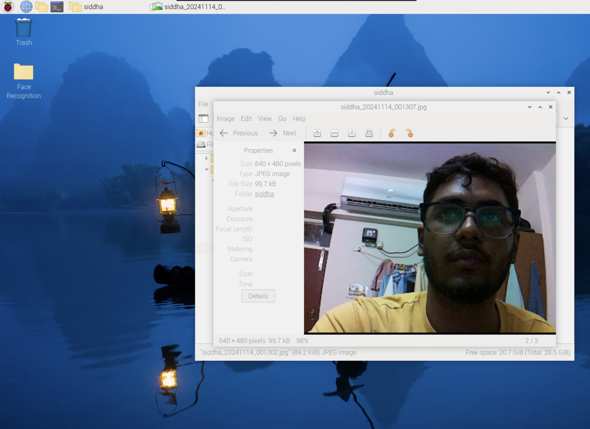
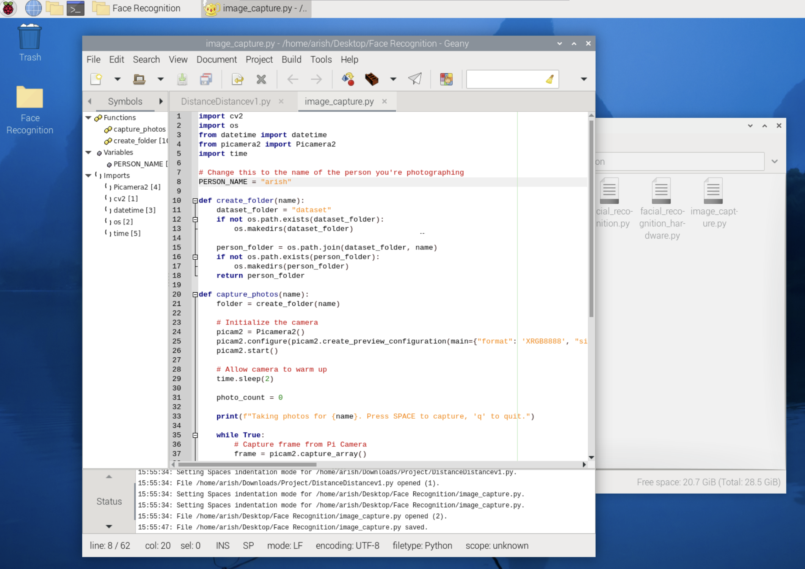
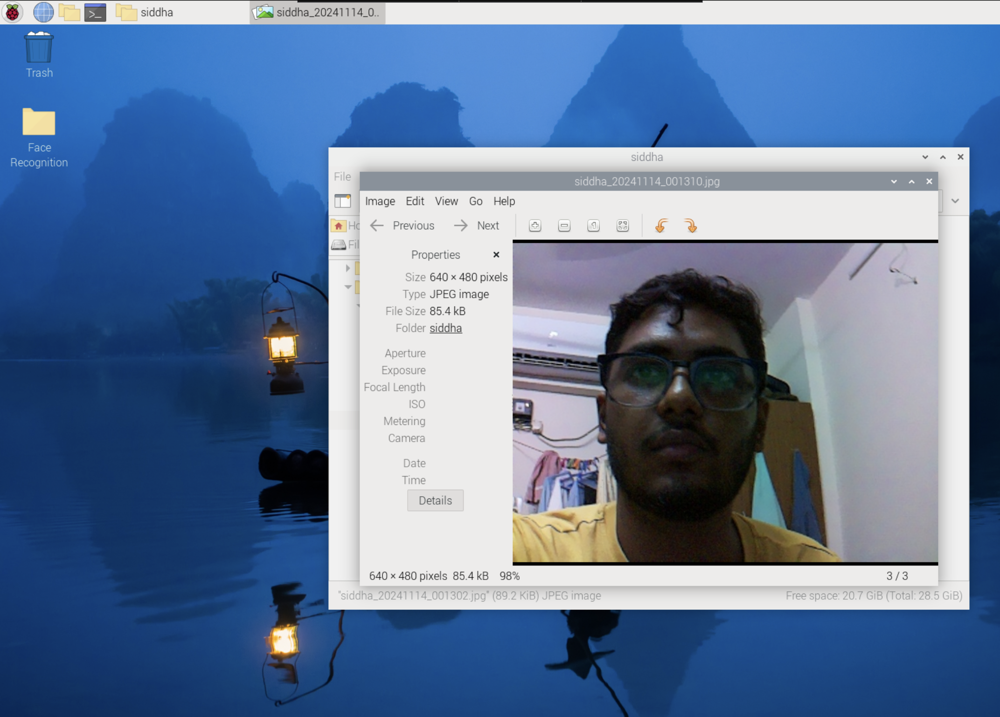

# VisionAssist-Pi
This project integrates **face recognition**, **ultrasonic distance measurement**, and **voice feedback** to assist partially impaired individuals. Built using **Python** and **Raspberry Pi**, it uses a camera for real-time face recognition and an ultrasonic sensor to detect nearby obstacles, providing audio feedback for guidance.

## Features
- **Face Recognition**: Identifies pre-trained individuals in real time.
- **Obstacle Detection**: Measures distance using an ultrasonic sensor and provides audio alerts for nearby obstacles.
- **Voice Feedback**: Uses `espeak` to provide spoken feedback in English.

---

## Prerequisites
Ensure your Raspberry Pi is set up with the following dependencies:

- Python libraries:
  - `face_recognition`
  - `picamera2`
  - `espeak`
  - `opencv-python`
  - `imutils`
  - `numpy`
- Hardware components:
  - Raspberry Pi
  - Camera module
  - Ultrasonic sensor (HC-SR04)
  - Speaker for audio output

---

## Usage

1. Capturing Photos for Face Recognition

To capture photos of individuals for face recognition:
- Run the following command: python image_capture.py
- Follow the on-screen instructions:
  - press SPACE to capture a photo.
  - Press Q to quit the photo capture session.
- Captured photos will be stored in the dataset/ folder under a subfolder named after the person.

2. Training the Face Recognition Model

Once photos have been captured: 
- Run the training module to process the images and generate encodings: python model_training.py
- This will create a file named encodings.pickle, storing the facial encodings for recognition.
- Running the Smart Assistance System

3. To start the main system:
- Run the following command: python facial_recognition.py
- The system will:
  - Identify individuals using the trained face recognition model.
  - Detect nearby obstacles using the ultrasonic sensor.
  - Provide real-time audio feedback for identified faces and obstacle distance.
- Press Q to quit the system.

---

### Screenshots

#### Real-time Image Capture

#### Model Training

#### Face Detection

